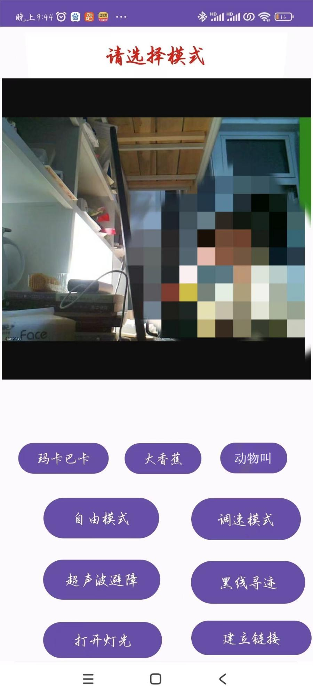

# LZY's RASPBERRYPI-CAR

## 项目简介

此项目是以树莓派4B为核心制作的智能小车。该小车具有基本的行进，速度调节，摄像头拍摄，超声波测距和超声波自动避障及警告，黑线寻迹，音乐播放，重力遥感等功能。同时也使用Android Studio构建了一个安卓手机的APP，并通过TCP实现了树莓派与安卓APP的远程连接（在同一局域网下），可使用APP远程监视和遥控树莓派智能小车。树莓派中代码使用 C 语言和Python 语言（基本是 C 语言）实现，手机 APP 使用 Java 语言开发。

[**小车功能视频演示**](https://www.bilibili.com/video/BV1CH4y1G7Js/?vd_source=6f30d76df52caedbaf72116ef9c59af6)

## 项目目录说明

`Android_lzy_rpicar_app`:安卓手机 APP 文件。

`raspi-car`:树莓派中运行的代码。 
    - `/car3.c`用于直接控制智能小车运行。 
    - `/car_socket.c`用于与手机 APP 进行链接控制小车运行。

`raspi-car-camera`:树莓派摄像头配置脚本（使用motion），由sgx鼎力支持。

`raspberrypi-car-lights`:树莓派灯光配置文件（由于硬件问题在其他设备可能不支持）。

## 配置方法

1. 参考[微雪wiki](https://www.waveshare.net/wiki/Raspberry_Pi_Documentation#.E8.BD.AF.E4.BB.B6)进行树莓派的基本配置

2. 安装wiringPi库，[wiringPi在github的链接](https://github.com/WiringPi/WiringPi)

3. 安装sox，用于播放音乐

4. 运行`raspi-car-camera/init.sh`进行摄像头配置

5. `raspberrypi-car-lights`内参考文档配置灯光

## 功能介绍

手机 APP 界面：
先点击**建立链接创建socket链接

1. 自由模式（包括重力感应模式）：小车可通过手机 APP 控制小车自由行进，其中可以开启 **“重力感应”**,利用手机设备自带的传感器，实现重力遥感功能。

2. 调速模式：利用PWM，实现可调速行进，共有5级速度。

3. 超声波避障：可进行对小车正前方的超声波测距，以及进行自动的超声波避障，在遇到障碍物时会发出警报并调换方向前进。

4. 黑线寻迹：通过5路灰度寻迹传感器，进行简易的黑线寻迹。

5. 打开灯光：开启车后的LED灯，有随机亮灯，流水灯，呼吸灯（PWM调节亮度）三种状态。

6. 播放音乐：点击“玛卡巴卡”，“大香蕉”，“动物叫”，播放相应的音乐。